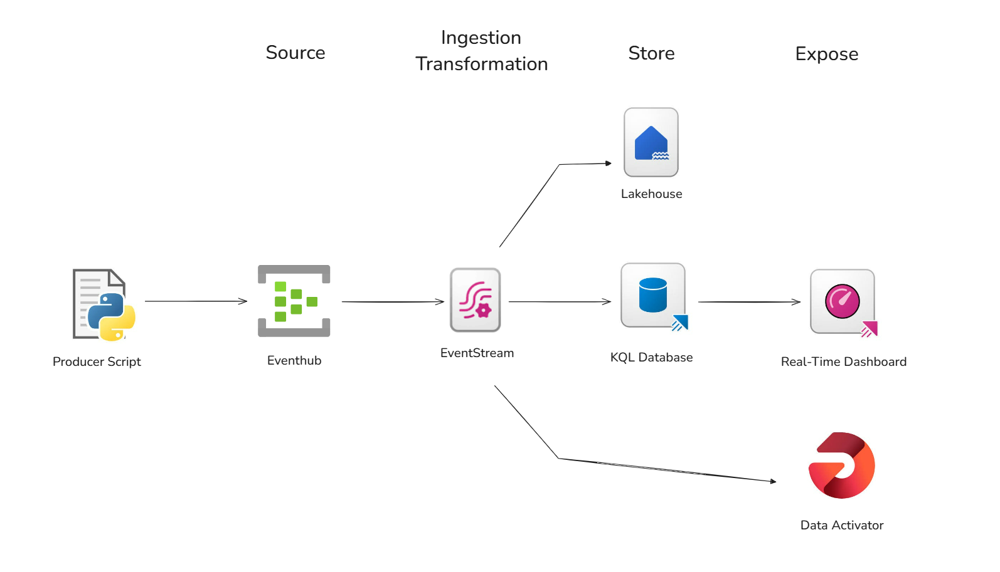

# Real-time Stock Data Analysis with Microsoft Fabric

This project demonstrates a real-time stock data analysis pipeline built using Microsoft Fabric. It ingests live stock data, performs real-time analysis and anomaly detection, stores historical data, and provides visualizations and alerts.

## Overview

The goal of this project is to:

* **Ingest real-time stock data:** Capture a continuous stream of stock market events.
* **Perform real-time anomaly detection:** Identify significant price changes compared to the previous trade.
* **Visualize real-time data:** Display current prices, trends, and anomalies on interactive dashboards.
* **Trigger alerts:** Notify users of significant price movements.
* **Store historical data:** Archive all raw stock data for long-term analysis.

## Architecture

The project utilizes the following Microsoft Fabric components:

* **Eventstream:** Ingests the real-time stock data feed from Azure Event Hub.
* **KQL Database:** Serves as the destination for real-time data, enabling low-latency queries and time series analysis.
* **Lakehouse (Delta Tables):** Stores historical stock data for long-term archival and batch processing.
* **RealTime Streaming Dashboard:** Connects to the KQL database to create real-time dashboards and visualizations.
* **Data Activator (formerly Reflex):** Monitors the KQL database for anomaly conditions and triggers alerts (e.g., email).
* **Azure Event Hub:** (External Service) Used as the source for the real-time stock data feed (simulated by a Python producer script).

### Source Layer

* **Producer Script (Python):**
    A Python script generates simulated stock trading events and sends them to Azure Event Hub in real-time.

    Each event contains stock information like symbol, price, volume, timestamp, and price change percentage.

* **Event Hub:**
    Azure Event Hub acts as a message broker, buffering the high-frequency stock events produced by the Python script.

    It ensures reliable and scalable ingestion of real-time event streams.

### Ingestion & Transformation Layer

* **EventStream (Microsoft Fabric):**
    Fabric Eventstream pulls stock event data from Event Hub.

    It perform lightweight transformations before routing the data to downstream systems.

### Storage Layer

* **KQL Database:**
    The transformed real-time data is streamed into a KQL database in Microsoft Fabric.

    It supports fast querying with Kusto Query Language (KQL) for analytics, dashboards, and real-time alerting.

* **Lakehouse (Delta Table):**
    Simultaneously, Eventstream routes a copy of the incoming data to a Lakehouse for historical storage.

    This allows for batch analytics, data science, and machine learning tasks on accumulated stock data over time.

### Exposure Layer

* **Real-Time Dashboard:**
    * Real-time stock prices
    * Volume trends
    * Anomaly detections
    * Aggregated metrics (e.g., average price, highest volume)

* **Data Activator (Microsoft Fabric Reflex):**
    Data Activator continuously monitors the KQL database for anomaly conditions (e.g., sudden price spikes/drops).

    Upon detecting an anomaly, it triggers an alert (such as an email).
